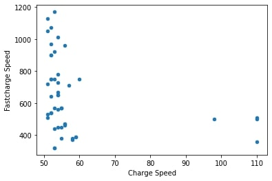

# Task
Greenwish Ltd needs a new fleet of sales rep cars for the UK. 
Employees, shareholders, clients and customers all want electric vehicles considering the large millage done by reps every year.

1. Which make and model to buy?
2. Which factors/variables are relevant to the decision?
3. Show your conclusions with persuasive visuals

## The main factors which can be viewed to decide which car is best are:
 - Fastcharge Speed
 - Battery Capacity
 - Maximum distance it can travel in different climates

### Which manufacturers make the most electric cars?
The dataset contained 34 different manufacturers. From these 34, only 11 have created over 6 different vehicles each. The biggest manufacturer is Mercedes with 24 vehicles, followed by Porche and Audi with 16 and 14 respectively. This would suggest that Greenwish Ltd board should select a car from one of these manufacturers

### How does fastcharging speeds differ across the vehicles?
One of the primary factors that is relevent to decide the car is how fast it can charge with a fast charging port. By comparing the charge speed to the fast charge speed, we can see there is very little correlation between it. As such, we can focus on the top left quadrant where the fast charging speed is the highest.

### Which car is most effective at fast charging?
Looking at the top 10 vehicles with the highest fast charging speed, we can see that they all have speeds above 900km, with the top 4 vehicles having over 1000km.

